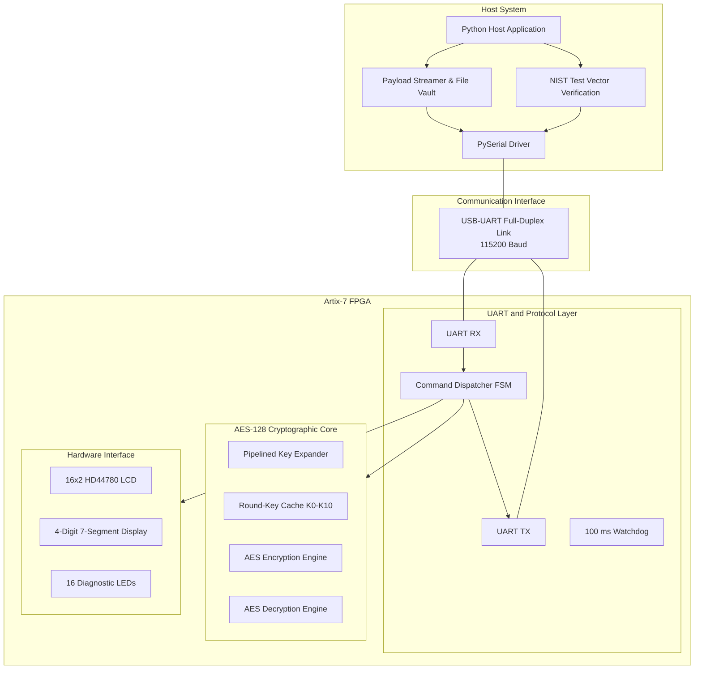

# Aegis-V: FPGA-Based Hardware Security Module

### NIST FIPS-197 AES-128 Cryptographic Co-Processor and Host Evaluation Suite

Aegis-V is an FPGA-based Hardware Security Module (HSM) and cryptographic co-processor implemented on an AMD-Xilinx Artix-7 FPGA (`XC7A35T-1FTG256C`).

The system implements an iterative 10-round AES-128 encryption and decryption engine, a pipelined on-the-fly AES key expansion module, a full-duplex UART communication interface, command processing logic, hardware watchdog protection, and a Python-based host application for cryptographic validation and file encryption.

---

## System Architecture



---

## Hardware Synthesis and Performance

All reported hardware metrics are based on post-route Vivado reports for AMD-Xilinx Artix-7 device `xc7a35tftg256-1`.

| Metric                       | Measured Result | Device Capacity | Utilization / Margin |
| ---------------------------- | --------------: | --------------: | -------------------: |
| Slice LUTs                   |           4,327 |          20,800 |               20.80% |
| Flip-Flops                   |           2,556 |          41,600 |                6.14% |
| F7/F8 Multiplexers           |           1,057 |          24,450 |                4.32% |
| User I/O                     |              42 |             170 |               24.71% |
| Global Clock Buffers         |               1 |              32 |                3.13% |
| Block RAM                    |               0 |              50 |                0.00% |
| DSP                          |               0 |              90 |                0.00% |
| System Clock                 |       50.00 MHz |               — |           Timing met |
| Clock Period                 |        20.00 ns |               — |                    — |
| Worst Negative Slack         |       +3.496 ns |               — |             Positive |
| Worst Hold Slack             |       +0.051 ns |               — |             Positive |
| Failing Timing Endpoints     |       0 / 6,082 |               — |                0.00% |
| Calculated Maximum Frequency |       60.59 MHz |               — |                    — |
| Total On-Chip Power          |          125 mW |               — |                    — |
| Dynamic Power                |           53 mW |               — |                    — |
| Static Power                 |           72 mW |               — |                    — |
| Junction Temperature         |         25.6 °C |     85.0 °C max |       59.4 °C margin |

---

## Microarchitecture

### Pipelined AES Key Expansion

The original unrolled key expansion implementation created a long combinational path through multiple AES S-Boxes and XOR stages.

The key expansion was redesigned as a registered iterative schedule:

* One round key generated per clock cycle.
* Key expansion implemented using the `ST_EXP_KEY` state.
* Critical path reduced to approximately 8.40 ns.
* All 11 AES-128 round keys are stored in hardware registers.
* Subsequent blocks using the same key can reuse the cached schedule without repeating key expansion.

For a cached key, the AES engine processes a block in 10 clock cycles, corresponding to 200 ns at 50 MHz, excluding UART communication overhead.

### AES-128 Encryption

The encryption datapath follows the AES-128 transformation sequence defined by FIPS-197:

* SubBytes
* ShiftRows
* MixColumns
* AddRoundKey

MixColumns is omitted from the final AES round as required by the AES specification.

### AES-128 Decryption

The decryption datapath implements the inverse AES transformation:

* InvShiftRows
* InvSubBytes
* AddRoundKey
* InvMixColumns

InvMixColumns is omitted from the final inverse round.

The implementation uses the standard AES inverse transformation coefficients:

* 0x0E
* 0x0B
* 0x0D
* 0x09

---

## UART Communication

The FPGA communicates with the host system using a full-duplex UART interface.

**Configuration:**

* Baud rate: 115,200
* Data bits: 8
* Parity: None
* Stop bits: 1
* Interface: USB-UART
* FPGA pins: C4 / D4

### Transmission Handshake

The UART transmitter uses a three-stage handshake:

```text
S_TX_BYTE
     |
     v
S_WAIT_BUSY_HIGH
     |
     v
S_WAIT_BUSY_LOW
```

This ensures that transmitted bytes are not overwritten before the UART interface has completed the previous transfer.

### Watchdog

A 100 ms hardware watchdog monitors incomplete or stalled communication sequences.

If a frame or command remains incomplete beyond the timeout period, the protocol state machine returns to `S_IDLE`.

---

## UART Command Protocol

| Command |    CMD |    LEN | Payload            | Response                    | Description                     |
| ------- | -----: | -----: | ------------------ | --------------------------- | ------------------------------- |
| SET_KEY | `0x01` | `0x10` | 16-byte key        | `0xAA`                      | Programs the AES-128 master key |
| ENCRYPT | `0x02` | `0x10` | 16-byte plaintext  | `0xAA` + 16-byte ciphertext | Encrypts one AES block          |
| DECRYPT | `0x03` | `0x10` | 16-byte ciphertext | `0xAA` + 16-byte plaintext  | Decrypts one AES block          |
| PING    | `0x04` | `0x00` | None               | `0x55`                      | Verifies FPGA communication     |

---

## AES Validation

The AES engine has been tested against the standard AES-128 test vector defined by NIST FIPS-197.

### Test Vector

**Key**

```text
000102030405060708090A0B0C0D0E0F
```

**Plaintext**

```text
00112233445566778899AABBCCDDEEFF
```

**Expected Ciphertext**

```text
69C4E0D86A7B0430D8CDB78070B4C55A
```

**FPGA Output**

```text
69C4E0D86A7B0430D8CDB78070B4C55A
```

The FPGA output matches the expected AES-128 ciphertext bit-for-bit.

---

## Repository Structure

```text
├── hdl/
│   └── hsm_top_artix7.v
│       Complete synthesizable Verilog implementation
│
├── constrs/
│   └── EDGE_Artix7_HSM.xdc
│       FPGA pin and timing constraints
│
├── host_app/
│   └── hsm_host_app.py
│       Python host application
│
├── bitstream/
│   └── hsm_top_artix7.bit
│       Compiled FPGA bitstream
│
├── docs/
│   ├── timing_summary.txt
│   ├── utilization_report.txt
│   ├── power_report.txt
│   └── aegis_v_architecture.tex
│
├── .gitignore
└── README.md
```

---

## Requirements

### FPGA

* AMD-Xilinx Artix-7
* Device: `XC7A35T-1FTG256C`
* Vivado 2025.2
* 50 MHz system clock

### Host

* Python 3
* PySerial

Install the required Python dependency:

```bash
pip install pyserial
```

---

## Deployment

### 1. Program the FPGA

Connect the Artix-7 development board to the host system and open Vivado Hardware Manager.

1. Select **Auto Connect**.
2. Detect the Artix-7 device.
3. Program the FPGA using:

```text
bitstream/hsm_top_artix7.bit
```

### 2. Start the Host Application

Run:

```bash
python host_app/hsm_host_app.py
```

Select the appropriate serial port and connect to the FPGA.

The host application provides:

* FPGA communication testing
* NIST AES-128 test-vector verification
* AES encryption and decryption
* Binary payload streaming
* File encryption and decryption
* UART communication diagnostics

---

## License

This project is licensed under the MIT License.
