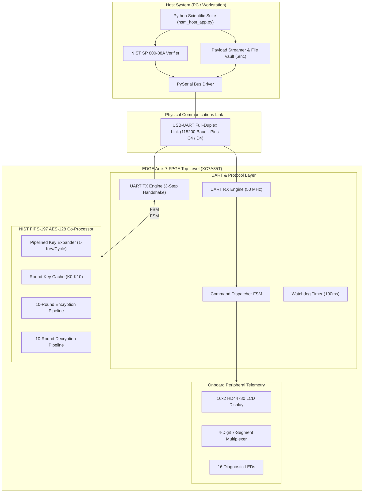

# 🛡️ Aegis-V: FPGA-Based Hardware Security Module (HSM)
### *NIST FIPS-197 AES-128 Cryptographic Co-Processor & Host Evaluation Suite*

[-blue.svg)]()
[]()
[]()
[-success.svg)]()
[]()
[]()

An end-to-end, high-performance **Hardware Security Module (HSM)** and cryptographic co-processor synthesized and routed on an **AMD-Xilinx Artix-7 FPGA (`XC7A35T-1FTG256C`)**.

The system implements a full 10-round iterative **AES-128 cryptographic engine**, a pipelined 1-key/cycle on-the-fly **Key Expander**, a full-duplex **UART bridge (115,200 baud)** with a robust 3-step physical handshake, and an interactive **Python scientific desktop application** for real-time payload streaming, file vault encryption, and NIST golden vector verification.

---

## 🏛️ System Architecture



---

## 📊 Hardware Synthesis & Performance Benchmarks

*All metrics are verified from post-route timing, power, and utilization reports in **Xilinx Vivado v2025.2** targeting part `xc7a35tftg256-1`.*

| Metric | Measured Silicon Result | Device Available | Utilization / Margin |
| :--- | :---: | :---: | :---: |
| **Logic LUTs (Slice LUTs)** | **4,327** | 20,800 | **20.80%** |
| **Registers (Flip-Flops)** | **2,556** | 41,600 | **6.14%** |
| **Multiplexers (F7 / F8)** | **1,057** | 24,450 | **4.32%** |
| **User I/O Pins** | **42** | 170 | **24.71%** |
| **Global Clock Buffers (BUFG)** | **1** | 32 | **3.13%** |
| **Block RAM / DSP** | **0** | 50 / 90 | **0.00% (Pure Distributed Logic)** |
| **System Clock Frequency** | **50.00 MHz** (20.00 ns) | — | **Timing Met (0 Violations)** |
| **Worst Negative Slack (WNS)** | **+3.496 ns** | — | **Positive Setup Margin** |
| **Worst Hold Slack (WHS)** | **+0.051 ns** | — | **Positive Hold Margin** |
| **Failing Timing Endpoints** | **0 / 6,082** | — | **0.00% Failure Rate** |
| **Max Operating Frequency** | **60.59 MHz** | — | 1 / (20.000 - 3.496) ns |
| **Total On-Chip Power** | **125 mW (0.125 W)** | — | 53 mW Dynamic / 72 mW Static |
| **Junction Temperature** | **25.6 °C** | 85.0 °C Max | Thermal Margin: 59.4 °C |

---

## ⚡ Microarchitectural Highlights

### 1. Timing-Closed Pipelined Key Expansion
* **The Problem**: An unrolled 10-round combinational key expansion cascade chains 10 S-Boxes and 40 XORs sequentially, creating an unroutable **29.16 ns critical path delay** (causing severe $-9.160\text{ ns}$ timing violations at 50 MHz).
* **The Solution**: Pipelined the Key Expander into an iterative **1-key/cycle registered schedule** (`ST_EXP_KEY`), reducing the path delay to **8.40 ns**.
* **Zero-Overhead Key Caching**: All 11 round keys ($K_0 \dots K_{10}$) are cached in hardware registers upon programming. When streaming multi-block files, subsequent blocks bypass expansion entirely and process in **10 clock cycles (200 ns) per block**.

### 2. Dual-Path FIPS-197 AES Transformation
* **Forward Cipher (Encryption)**: Iterative pipeline executing `SubBytes (16x S-Box LUTs)` $\rightarrow$ `ShiftRows` $\rightarrow$ `MixColumns (GF(2^8) Matrix)` $\rightarrow$ `AddRoundKey` ($K_1 \dots K_9$), with `MixColumns` bypassed in Round 10.
* **Inverse Cipher (Decryption)**: Standard inverse datapath executing `InvShiftRows` $\rightarrow$ `InvSubBytes (16x Inv S-Box LUTs)` $\rightarrow$ `AddRoundKey` ($K_{10-r}$) $\rightarrow$ `InvMixColumns (GF(2^8) Polynomials 14, 11, 13, 9)`, with `InvMixColumns` bypassed in Round 10.

### 3. Bulletproof 3-Step UART Handshake & Watchdog
* Implements a deterministic 3-step transmission handshake (`S_TX_BYTE` $\rightarrow$ `S_WAIT_BUSY_HIGH` $\rightarrow$ `S_WAIT_BUSY_LOW`) preventing byte clobbering and buffer overruns during high-speed serial streaming.
* Includes a **100 ms hardware auto-timeout watchdog** that restores the receiver FSM to `S_IDLE` in the event of dropped or incomplete frames.

---

## 📡 UART Frame & Command Protocol

The FPGA communicates with the host suite over a full-duplex binary frame protocol at **115,200 baud, 8-N-1**:

| Command | CMD | LEN | PAYLOAD (16 Bytes) | FPGA Return Response | Description |
| :--- | :---: | :---: | :---: | :---: | :--- |
| **SET_KEY** | `0x01` | `0x10` | 128-Bit Master Key | `0xAA` (ACK) | Burns key into hardware registers and expands schedule |
| **ENCRYPT** | `0x02` | `0x10` | 128-Bit Plaintext Block | `0xAA` + 16B Ciphertext | Executes 10-round AES encryption |
| **DECRYPT** | `0x03` | `0x10` | 128-Bit Ciphertext Block | `0xAA` + 16B Plaintext | Executes 10-round inverse AES decryption |
| **PING** | `0x04` | `0x00` | *None* | `0x55` (ACK) | Hardware presence and handshake verification |

---

## 🧪 NIST SP 800-38A Validation Test Vector

The hardware engine has been verified bit-for-bit against official NIST golden test vectors:

* **Master Key (K)**: `000102030405060708090A0B0C0D0E0F`
* **Plaintext (P)**: `00112233445566778899AABBCCDDEEFF`
* **Expected Output (C)**: `69C4E0D86A7B0430D8CDB78070B4C55A`
* **FPGA Hardware Output**: `69C4E0D86A7B0430D8CDB78070B4C55A` $\rightarrow$ **100% Bit-for-Bit Match**

---

## 📂 Repository File Tree

```text
├── hdl/
│   └── hsm_top_artix7.v         # Complete synthesizable Verilog top-level, AES engine & UART
├── constrs/
│   └── EDGE_Artix7_HSM.xdc      # Physical pin constraints (Clock, UART C4/D4, LCD, 7-Seg)
├── host_app/
│   └── hsm_host_app.py          # Python scientific desktop GUI host application
├── bitstream/
│   └── hsm_top_artix7.bit       # Pre-compiled bitstream ready to flash via Vivado
├── docs/
│   ├── timing_summary.txt       # Official post-route timing summary (WNS +3.496 ns)
│   ├── utilization_report.txt   # Official resource utilization report (4,327 LUTs)
│   ├── power_report.txt         # Official routed power report (125 mW)
│   └── aegis_v_architecture.tex # LaTeX/TikZ source code for vector system block diagram
├── .gitignore
└── README.md
```

---

## 🚀 Quickstart & Replication

### 1. Flash the FPGA Hardware
1. Connect your **EDGE Artix-7 Development Board** to your PC via USB.
2. Open **Vivado Hardware Manager** $\rightarrow$ **Auto Connect**.
3. Program device `xc7a35t_0` with `bitstream/hsm_top_artix7.bit`.
4. The onboard **16x2 LCD** will immediately initialize with:
   ```text
   HSM: AES-128 *
   BLK:0000 [OK]
   ```

### 2. Launch the Scientific Host Suite
1. Install Python serial dependencies:
   ```bash
   pip install pyserial
   ```
2. Run the application:
   ```bash
   python host_app/hsm_host_app.py
   ```
3. Select your serial COM port and click **Connect Device**.
4. Click **"Run NIST Golden Test Vector"** to mathematically verify the silicon engine in real-time.
5. Use the **Binary Payload & File Vault** tab to encrypt and decrypt arbitrary files (.pdf, images, binary datasets).

---

## 📄 License
This project is licensed under the **MIT License** - see the [LICENSE](LICENSE) file for details.
